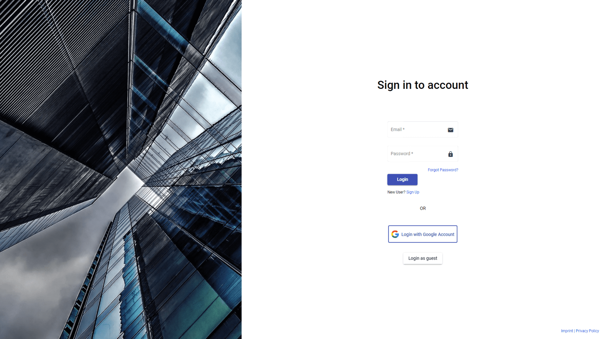
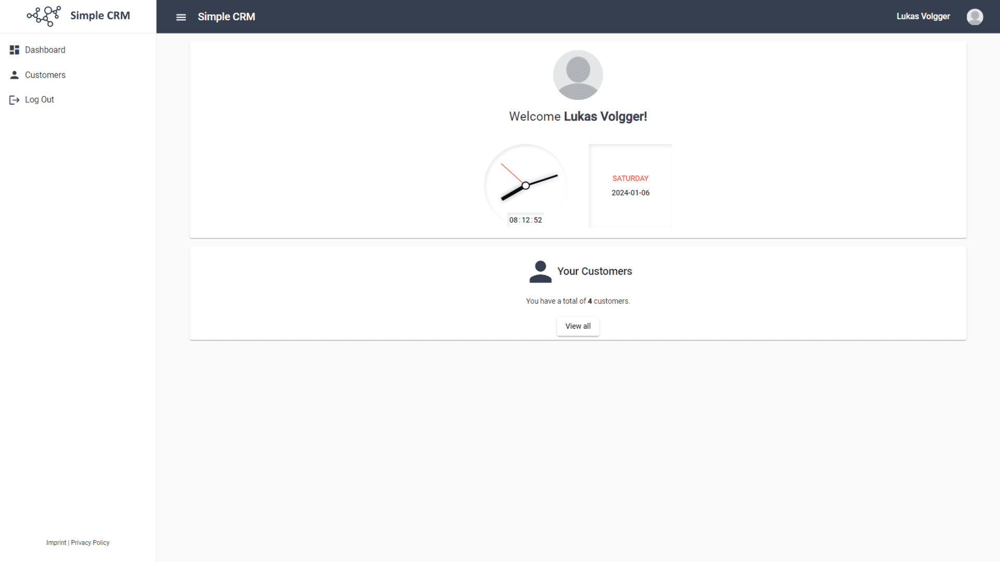
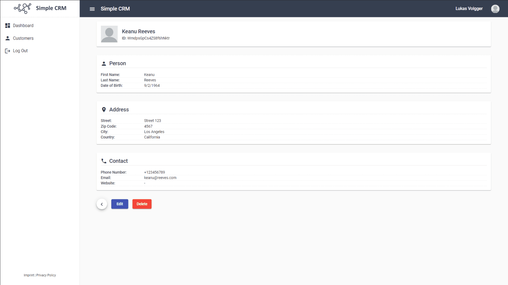

# Simple-CRM
Simple customer management. A simple CRM (Customer Relationship Management) tool with features like user registration, authentication and data storage in the backend (Firebase).

**<u>IMPORTANT:</u>** Lorem ipsum dolor sit amet, consetetur sadipscing elitr, sed diam nonumy eirmod tempor invidunt ut labore et dolore magna aliquyam erat, sed diam voluptua.

**Table of Contents**

- [Simple-CRM](#simple-crm)
  - [Features](#features)
  - [Preview](#preview)
  - [Run the Application](#run-the-application)
    - [1. Requirements](#1-requirements)
    - [2. Clone the Source](#2-clone-the-source)
    - [3. Download and install Dependencies](#3-download-and-install-dependencies)
    - [4. Start Development Server](#4-start-development-server)
    - [Further help](#further-help)
  - [Feedback \& Support](#feedback--support)
  - [License](#license)
    - [Graphics](#graphics)
    - [Source Code](#source-code)

## Features
Here is an overview of the most important functions of the project.

**Available Languages**

- English
  
**Functionality**
  
- Cloud storage (Google Firebase)
- Guest login for preview
- User login
- Sign up with email
- Sign up with Google account
- Forgot password functionality
- Dashboard with general overview and information
- Add / update / delete customers
- Profile management (Update / Delete)

## Preview



---



---



## Run the Application
Follow these steps to run the application.

### 1. Requirements
Install the following required software:

- [Node.js & npm](https://nodejs.org/en)
- [Angular CLI](https://angular.io/guide/setup-local)


### 2. Clone the Source
Clone the source code or download the repository on your local computer by clicking the **Code** button.

``` bash
git clone https://github.com/LukasVolgger/simple-crm.git
```

### 3. Download and install Dependencies
Navigate to the project directory and execute the following command:

``` bash
npm install
```

### 4. Start Development Server

``` bash
ng serve --open
```

The development server will start on `http://localhost:4200/`. The application will automatically reload if you change any of the source files.

### Further help
To get more help on the Angular CLI use `ng help` or go check out the [Angular CLI Overview and Command Reference](https://angular.io/cli) page.

## Feedback & Support
Your feedback is invaluable, and I'm here to assist you with any questions or concerns. Your input plays a crucial role in enhancing the project and optimizing the user experience. Feel free to reach out to me:

- **Feedback:** Share your thoughts, suggestions, or ideas with me so that I can continuously work towards improvement.

- **Support Inquiry:** If you encounter difficulties or need assistance, [create a new GitHub issue](https://github.com/LukasVolgger/simple-crm/issues/new). Please describe your issue in detail to enable me to provide quick and accurate support.

Thank you for your support!

## License
Please note the following license terms with regard to the graphics used and the source code.

### Graphics
<!-- 1. Public Domain -->
All graphics/images used are licensed under the Creative Commons license [CC0 Public Domain](https://creativecommons.org/publicdomain/zero/1.0/deed.en).

### Source Code
The source code is subject to the following license:

[MIT License](./LICENSE.md)
